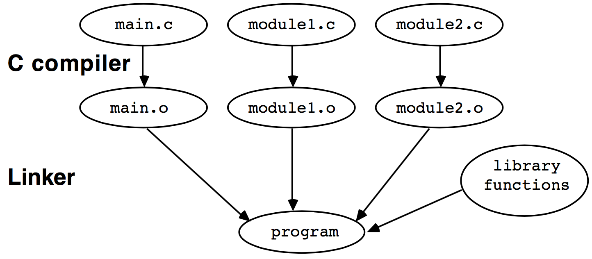

% Lecture notes in CIS342 
% Yuzhe Tang, Amin Fallahi
% Spring, 2017

Section 2: Programming in C/C++ 
===

gcc & make (Mar. w4)
===

References
---

- "Unix Programming Tools", [[link](http://cslibrary.stanford.edu/107/UnixProgrammingTools.pdf)]
- Computer Systems: A Programmer's Perspective, Randal E. Bryant and David R. O'Hallaron, Chapter 1, [[online pdf](http://csapp.cs.cmu.edu/2e/ch1-preview.pdf)]

- Source files: [[src directory](./marw4)]

Compilation overview
---

- Two steps of compilation:
    - *compiling*: text `.c` file to  relocatable `.o` (object) file
    - *linking*: multiple relocatable `.o` files to one executable `.o` file
        - *symbol*: reference to link construct (declaration) in one `.o` file to construct (definition) in another `.o` file

---



<!--

-->


C: basics
---

```c
#include <stdio.h> //preprocessor
int y = 3; //global var. (def. & init.)
//extern int y; //global var. (dec.)
int main() //function (def.)
{
    int x = 0; //local var. (def. & init.), literal, 
    printf("y = %d\n",y); //function (invocation)
    return 0;
}
```

Life of a C construct
---

| | variable | function 
| --- | --- | --- |
| declaration | `extern int x;` | `void foo();`
| definition | `int x;` | `void foo(){}`
| initialization | `int x = 6;`
| assignment | `x = 1;`
| reference | `y = x;` | `foo();` (invocation)
| destroy

Gcc: Flags
---

- `-c` for compile, `-o` for output; demo
- `-Wall`, w for warning; demo 
- `-I` for `#include`; demo
    - header file (storing declarations)
- `-Ldir`/`-lmylib` for library to link
    - search library for unsolved symbols (functions, global variables) when linking
- `-g` for debug (later)
- ref [[link](https://gcc.gnu.org/onlinedocs/gcc/Option-Summary.html#Option-Summary)]

<!-- 

Advanced topics on GCC
---

Compiler process

| compilation step | | main flag | secondary flags |
| --- | --- | ---  | --- |
| preprocessor | `.c`->`.i` | | `-I./includes` (rpath) 
| compiling | `.i`->`.o` | `gcc -c` |
| assembler | `.s`->`.o`(relocatable) | `gcc -s` |
| linker | `.o`(relocatable),`.a`->`.o`(executable) | (no flag) | `-L. -lx`, `-Wl,` |
 
* `-Wl,option` Pass `option` to the linker. For example, `-Wl,-Map,output.map` passes `-Map output.map` to the linker.
- `-L`
    - gcc flag `-L/home/lib` is equal to environment var `export LIBRARY_PATH=/home/lib`
- `gcc A B`: it compiles B first then A.

-->

make
---

```
all: link
\t./a.out

linklib: compilelib
\tgcc h1.o -L. -lx #-L. is necessary

compilelib: compile
\tmv h2.o libx.a

link: compile 
\tgcc h1.o h2.o

compile:
\tgcc -c h1.c
\tgcc -c h2.c

clean:
\trm *.o *.out
```

```
SRCS = h1.c h2.c
OBJS = $(SRCS:.c=.o)

all: link
\t./a.out

link: $(OBJS)
\t$(CC) $(OBJS)
```

Makefile: Variables
---

- variable represents strings of text
- standard variable: `CC`, `CFLAGS`, `LDFLAGS`
    - `LDFLAGS` library search path (`-L`)
    - `OBJS = $(SRCS:.c=.o)`: 
        - This incantation says that the object files  have the same name as the .c files, but with .o

Makefile: Dependency rules
---

- dependency rules: tells how to make a target based on changes to a list of certain files.
- If-this-then-that
    - dependency line: a trigger that says when to do something
    - command line: specifies what to do
    
<!-- 

Homework 4 - 2
---

1. In your Ubuntu, open course website (https://github.com/syracuse-fullstacksecurity/cis342) (e.g. using Firefox) and hit the green "Clone or download" button to download all the files into a .zip file. Extract the zip file and cd into "marw4" directory. Type command "make"  to build and execute binary "a.out". Type command "ls" to list all files. Then type command "make clean" and command "ls" to show object files (with extension ".o") are gone. Submit a screenshot of your terminal.

2. We use the following command to compile `h2.c` as a library: `gcc -c h2.c -o liby.a`. Edit the file named "makefile" and add a new rule about the command. You may use `compilelib` as its label. And then type "make compilelib" to compile `h2.c` as a library. Submit the screenshot.

3. We can compile `h1.c` and link it to the library we just created using command `gcc -o a.out h1.c -L. -ly`. Add this command to the makefile with a new rule named `liblink`. What argument do you provide to "make" so that it can link the library liby. Provide a screenshot of making the program.

Advanced Makefile
---

```
source1:
source2:
xxx: source1 source2
	@echo $^ #source1 source2
	@echo $@ #xxx
	@echo $< #source1
```

```
PWD = $(shell pwd) #variable assigned by shell command
```

-->


GDB (Mar. W5)
===

References
---

- "Reviewing gcc, make, gdb, and Linux Editors", [[pdf](https://courses.cs.washington.edu/courses/cse333/11sp/sections/section01.pdf)]
- "Unix Programming Tools", [[link](http://cslibrary.stanford.edu/107/UnixProgrammingTools.pdf)]

A buggy program
---

```c
#include<stdio.h> //printf
int main(){
  int array_stack[] = {0,1,2};
  int sum = 0;
  for(int i=0; i<=3; i++){
    sum += array_stack[i];
  }
  printf("sum = %d\n", sum);
  return 0;
}
```

Use gdb to find bug
---

- Installing gdb
- Compile: `gcc -g`
- Run gdb: `gdb a.out`

Gdb command: control execution
---

- C execution model
- breakpoints
    - `break/b file:n|fn|file:fn`
    - `disable/enable/delete  bkpt`: `bkpt`=`file:n|fn|file:fn`
- stepping
    - `run/r`: run
    - `next/n`: next statement (step over a function call)
    - `continue/c`: continue till breakpoint

Gdb command: examine runtime
---

- examine runtime data
    - `print v`/`p v`: print variable `v`
- examine code (with `gcc -g`)
    - `list/l`
- examine execution environment: e.g. stack (later)

Gdb functionality
---

| functionality | commands |
| --- | --- |
| breakpoints | `b`,`disable/enable/delete breakpoint`
| stepping | `r`,`s`,`n`,`c`,`finish`,`return`
| examine_data | `p/i v`,`display/undisplay`,`watch`,`set v=expr`
| examine_code | `list`
| examine_stack | `bt`,`where`,`info`,`up/down`,`frame`
| misc. | `editmode vi`, `b fn if expression`, `help`, disassembler, `shell cmd` 

Demo & exercise
---

- Exercise: Debug the following program using gdb, upload the correct program to BB.

```c
#include<stdio.h> //printf
int main(){
  int a1[] = {2,1,0};
  int sum = 0;
  int i;
  for(i=0; i<=2; i++){
    sum += a1[i]/a1[2-i];
  }
  printf("sum = %d\n", sum);
  return 0;
}
```

<!--

GDB Homework
---

- Which GDB command produces a stack trace of the function calls? a) trace b) backtrace c) forwardtrace d) none of the mentioned
- While debugging with GDB: a) variables can be printed out b) variables can be modified c) both (a) and (b) d) none of the mentioned
- In the following program, at breakpoint line 3, when you type "p x", what value will be printed out? At breakpoint line 6, when you type "p x", what value will be printed out?

1   void foo1(void){
2      int x = 1;
3      int y = 2;
4   }
5   void foo2(void){
6      int x = 3;
7      int y = 2;
8   }
9   int main(){
10      foo1();
11      foo2();
12      return 0;
13  }

- The following program contains a bug. Use gdb to identify the buggy codeline, and submit the line number. 

 1	#include<stdio.h>
 2	#include<string.h>
 3	int main(void)
 4	{
 5	   char base_digits[16] =
 6		 {'0', '1', '2', '3', '4', '5', '6', '7',
 7		  '8', '9', 'A', 'B', 'C', 'D', 'E', 'F'};
 8	   char *lastdigit = "F";
 9	   int converted_number[64];
10	   long int number_to_convert;
11	   int next_digit, base, index=0;
12	   number_to_convert=12345;
13	   base=5;
14	   while (number_to_convert != 0)
15	   {
16		 converted_number[index] = number_to_convert % base;
17		 number_to_convert = number_to_convert / base;
18		 ++index;
19	     *lastdigit = 'E';
20	   }
   
21	   --index;
22	   printf("\n\nConverted Number = ");
23	   for(  ; index>=0; index--)
24	   {
25		 printf("%c", base_digits[converted_number[index]]);
26	   }
27	}

-->


<!--
Advanced gdb commands
---

```
p/x var #print var in hex form
```

```
# Capturing printout before crash
./a.out > printout
...
call fflush(0)
```
-->

Pointer in C (Apr. W1)
===

References
---

- Pointer Basics: [[http://cslibrary.stanford.edu/106/](http://cslibrary.stanford.edu/106/)]

Pointer (C syntax)
---

- a pointer is a variable that stores a reference to something. 
     - "something", called pointee, is usually another variable.
- e.g.: a pointer variable named `x` referencing to a "pointee" variable of value `42`. 


<!--


-->

Pointer operations
---

- definition/initialization: `int *p1 = p2;` 
- dereference: `*p`
- get reference of: `& a` 
    - get the *address* (memory location) of variable `a` 

```c
#include<stdio.h>
int main(){
    int a = 10;
    int * p = & a;
    int b = *p;
    printf("a=%d,b=%d,*p=%d,p=%p\n",a,b,*p,p);
}
```

Life of a `C` pointer/symbol
---

| | pointer | variable | function |
| --- | --- | --- | --- |
| declaration | `extern int * p` |`extern int x` | `void foo()` | 
| definition | `int *p;` | `int x` | `void foo(){}` | 
| initialization | `int *p=&a;` | `int x=6` | |
| | `int*q=malloc(7)` | |
| assignment | `p=&a` | `x=1` | |
| reference | `*p=x;x=*p` | `y=x` | `foo()` |
| destroy | `delete p` | | |

<!--

`int *p` (behavior undefined!) 

-->

Exercise
---

- Do the following to complete the code snippet at the bottom. Then compile and execute your program. Submit the completed program to BB.
    1. define two pointers `p1` and `p2`, both pointing to variable `x`. 
    2. Use `p1` to update `x`'s value to `5`.
    3. Then use `p2` to read the value of variable `x` and `printf` it on terminal.

```c
#include<stdio.h>
int main(){
    int x = 4;
    // To complete the program below:


}
```

Virtual memory in C (Apr. W1)
===

Introduction
---

- we talked about pointers
- but **where does a pointer point to?**
- this is related to the *virtual memory* model in C/C++.
- References
    - "Using GNU's GDB Debugger: Memory Layout And The Stack", by Peter Jay Salzman [[link](http://www.dirac.org/linux/gdb/02a-Memory_Layout_And_The_Stack.php)]


Four variable "types" in C
---

1. *global* variable: defined outside a function
2. *local* variable: defined inside a function
3. *dynamically-allocated* variable: allocated by `malloc()`
    - `int * p = malloc(2*sizeof(int));`
4. *static (local)* variable: defined inside a function, with keyword `static`
    - `static int x;`, [[example](https://en.wikipedia.org/wiki/Static_variable#Scope)]

---

```c
#include<stdio.h>
#include<stdlib.h>
// global variable x
int x = 1;
void foo(){
  static int t = 5;
  printf("t in foo = %d\n", t);
}

int main(){
  // local variable y
  int y = 2;
  // dynamically-allocated variable pz
  int * pz = malloc(2*sizeof(int));
  // static local variable t
  static int t = 4;
  foo();
  printf("t in main = %d\n", t);
  printf("x at %p\ny at %p\npz to %p\nt at %p\n", &x, &y, pz, &t);
  return 0;
}
```

Variable type: scope and visibility
---

| variable type | scope | visbility | memory location |
| ---- | --- | --- | --- |
| global variable | global | global | `.rodata`/`.bss` |
| static variable | global | nested local | `.rodata`/`.bss` |
| local variable | local | nested local | `stack` |
| dynamically-allocated var | dynamic | global | `heap` |

- static local variable
    - Possible to define multiple static local variables of the same name, defined in different functions. 
    - They represent different memory locations. 
- The case of the preceeding code.

Virtual memory layout
---

1. Segments `.text,.bss,.rodata` 
    - From executable `a.out`
2. Segments `stack`, `heap`
    - Runtime info.: values of symbols during execution
- Each segment (or page) has its own permission. 


Virtual memory layout
---

```
 VirAddr Space               
+------------+--+     
|  kernel    |  |        a.out     
+------------+--+     +----------+
|  .text     |EO|     |  .text   |
+------------+--+     +----------+
|  .rodata   |RO|     | .rodata  |
|  .bss      |RW|     | .bss     |
+------------+--+     +----------+
|  heap      |RW|
+---------+--+--+     
|         |  |--|     
|  ^      V  |--|     
|  |         |--|     
+--+---------+--+     
|  stack     |RW|     
+------------+--+                  
```

- Demo: print memory layout in Gdb
    - `info proc mappings #print mem layout`

<!--

Executable file format (ELF)
---

- The file format of `a.out`
- Sections
    - code `.text` 
    - constant value `.rodata`
    - demo: `size a.out` (sections)
- Symbol table
    - demo: `nm -m a.out` (symbol table)

Symbol table
---

- basic symbol table `gcc x.c`
    - name list: addresses of symbol names and machine code
- enhanced symbol table `gcc -g x.c`: 
    - for each symbol (variable and function address), name
    - for each machine codeline, its source codeline
    - source file name 

```
+------+----+----+
|symbol|addr|name|
+------+----+----+
|var   |7ff1| x  |
+------+----+----+
|func  |8005|foo |
+------+----+----+
|code  |    |    |
+------+----+----+
```

```bash
gcc bug1.c; 
gcc -g bug1.c -o b.out; 
nm -ma a.out
nm -ma b.out
```
-->

Examining Stack 
---

- stack: frames, local variables, argments, return
    - `backtrace`/`bt`/`bt full`,`where`
    - `up`,`down`,`frame #`
        - **context**

<!--

Exercise
---

- Use gdb to debug the following program. Set a breakpoint at `fact` function and examine the stack using `backtrace` during the execution of the program. Find and describe the bug in BB.

```c
#include <stdio.h>
int fact(int x){
  return x*fact(x-1);
}
int main(){
  printf("%d\n",fact(5));
}
```

-->

Exercise 1
---

- Use gdb to debug the following program. Identify the bug line.

```c
int main() {
     void * p = "x";
     *p = 'y';}
```

Exercise 2
---

- Use gdb to debug the following program. Identify the bug line.

```c
#include<stdio.h>
int main() {
    double x[10000000]; //vs x[1000];?
    x[13]=1; printf("%f\n",x[13]);}
```

<!--

- Segmentation fault
    - buffer overflow: stack/heap...
    - memory protection
    - null pointer dereference

-->

<!--

Pointer Homework

- Compile and execute the following program. Describe the difference between a pointer and an array. What is the difference if we use an array instead of a pointer in the following program?
#include <stdio.h>
void main(){
        int *a;
        int i;
        for (i=0; i<10; i++)
                a[i]=i;
        for (i=0; i<10; i++){
                printf("%d",*a);
                (*a)++;
        }
}
- In the previous question, what will happen if we assign 10000 values instead of 10 values to the pointer? Why?
- Write code to declare a variable named "foo". Now declare a pointer named "bar". What do you do to make foo changed everytime we change bar?
- We can find out the size of a variable using sizeof(varname) and print it using printf("%d",sizeof(varname)). Print the size of variables "a", "i", "a[0]", and "a[1]" in the program in first question. Describe your observation.
- The _________ , also known as the address operator, returns the memory address of a variable. a.asterisk (*) b. ampersand (&) c. percent sign (%) d. exclamation point (!)
- With pointer variables, you can __________ manipulate data stored in other variables. a. never b. seldom c. indirectly d. All of these
- A pointer may be initialized with a. the address of an existing object b. the value of an integer variable c. the value of a floating point variable d. all of these

-->

Assembly language (Apr.w2)
===

References
---

- Hacking, the art of expoitation, 2nd edition, Jon Erickson, Chapter 0x250

Architecture overview
---

- x86 CPU registers
    - RAX,RBX,RCX,RDX: values
    - RSP,RBP,RSI,RDI: pointers
    - **RIP**
    - (EFLAG)
- demo in gdb: 
    - `info registers #print register values`
    - `i r rip #print register rip`

---

- CPU execution model
    - like "a child pointing his finger at each word as he reads"
    - RIP, or PC, is the CPU's finger
    - words are instructions stored in section `.text` in virtual memory
        - machine instructions
        - assembly

Assembly code: Where to find it
---

- program life cyle
    - preprocessor: 
    - compiler: assembly code
    - assembler: machine instruction (PIC)
    - linker: machine instruction (executable)
    - loader: loaded in virtual addr space

```
   prep     gcc -S     gcc -c          ld/gcc       exec   
.c------>.i-------->.s-------->.o(PIC)------->a.out------>VM
```

- Three places to examine assembly code
    - `gcc -S helloworld.c; vim helloworld.s`
    - `objdump -M intel -D a.out | grep -A20 main`
    - in `gdb`: `set disassembly intel; disassemble main`

<!--
objdump -x86-asm-syntax=intel -D aprw2/a.out | grep -A20 main
-->

Assembly language
---

- ISA: 
    - ALU instruction: `add`
    - LD/ST instruction: `mov`
    - Control instruction: `jump`, `cmp; jle foo`
- Format: AT&T and Intel
    - AT&T: `89 e5    mov %rsp,%rbp`
    - Intel:`89 e5    mov rbp rsp` 

Demo: CPU execution in action
---

```c
#include <stdio.h>
int j = 3;
int main() {
  int i = 0;
  i = i + 2;
  if (i == 2)
    puts("Hello, world!\n"); // put the string to the output. 
}
```

Assembly in Gdb
---

- `nexti`: step per instruction
- `x`: gdb command to e`x`amine memory
    - `x/3xb $rip`
    - `x/x`: `o/x/u/t`
        - `t` binary, `u` unsigned, `o` octal
    - `x/3b`: `b/h/w/g`
        - `b` byte, `h` halfword, `w` word, `g` giant
    - `x/4i`
        - `i` instruction


<!--
Exercises:
- Run the following program. What is it supposed to do? What is the problem with it? How can you solve the problem?
#include<stdio.h>
#include<string.h>
void main(){
	char a[20];
	int i;
	strcpy(a,"hello world");
	for (i=20; i>=0; i--)
		printf("%c",a[i]);
}
- Compile the following program to assembly. Can you find where printf is implemented?
#include<stdio.h>
void main(){
		printf("Hello world!");
}
- Use `objdump -S a.out` with the previous code. What do you observe?
- What is the data size for int type? What value you can copy to an int variable to exceed that? What happens if you exceed the size? Write program and debug with gdb.
- Compile and run this program. What is the problem with it? How can you extend the size of the string to accept arbitrary number of chars?
#include<stdio.h>
void main(){
	char a[1];
	int i;
	for (i=0; i<1000; i++)
		a[i]='a';
	printf("%s",a);
}
- If you use a char* in the previous program, can you copy as many characters into it as you want? Why?
- Use malloc to assign more memory to char *a; Can this solve the problem?


- gdb setup
    - gdb -q
    - `.gdbinit`

0x260

Pointer in Assembly
---


Function in Assembly
---

- calling convention
- function prologue
    - generated automatically by compiler
    - the reason why variable type needs to be declared

-->

C Varibales, Functions from Assembly's Perspective
===

References
----

- Hacking, the art of expoitation, 2nd edition, Jon Erickson, Chapter 0x260,270,280
- Smashing The Stack For Fun And Profit, [[link](http://insecure.org/stf/smashstack.html)]

Data type
---

- signed, unsigned, long long, float, char
    - unsigned: 
        - a 32-bit unsigned integer, value from 0 to $2^{32}-1$.
    - signed: 
        - a 32-bit unsigned integer, value from $-2^{31}$ to $2^{32}-1$.
        - negative numbers are represented by two's complement, (which is suited for binary adders).
- C data type is memory allocation size
    - C is typed, but assembly/machine instructions are not
    - `sizeof()`

| type | signed | unsigned | short | long long | float | char |
| --- | --- | --- | --- | --- | --- | --- |
| sizeof | 4 | 4 | 2 | 8 | 4 | 1 |

Typecasting
---

```c
#include<stdio.h>
int main(){
  int i = 5;
  float f = (float) i
  float d = f/3; // float d2 = i/3;
  printf("%f\n",d);
}
```

Pointer types
---

- Array 
    - A `C` array is a list of `n` elements of a specific data type, and allocated in `n` adjacent memory locations.
    - A null byte in the end is a delimiter character 
- Array and pointer
    - `int a[];` vs `int *b = a;`

```c
#include<stdio.h>
int main(){
    int a[] = {2,1,0};
    int *b = a;
    unsigned long c = (unsigned long)a;//long
    for (int i=0; i<3; i++){
        printf("%d,%d,%d,%d,%d\n",a[i],*(b+i),*(a+i),b[i],*((int *)(c+i*sizeof(int))));
    }
}
```


<!--

Exercise
---

```c
#include<stdio.h>
int main(){
    int a[] = {2,1,0};
    int *b = a;
    unsigned int c = (unsigned int)a;
    for (int i=0; i<3; i++){
        printf("%d,%d,%d,%d,%d\n",a[i],*(b+i),*(a+i),b[i],*((int *)(c+i*sizeof(int))));
    }
}
```
-->

---

- Code-pointer: function pointer
- Data-pointer: pointer to variable, array
    - Pointer data type: `char *`, `int *`, 
    - Pointer arithmetic: equiv. code
        - `int * p = array; p += 1;`
        - `int pp = array; pp += sizeof(int);`

Function execution and stack
===

Stack
---

- Stack:
    - store **context** information
    - a stack of frames, with the top frame pushed (popped) by entering (leaving) a function
- Stack pointer: `RSP`, pointing to the stack end
- Frame pointer: `RBP`, pointing to the start of top frame.


Entering function in Assembly
---

- Calling convention, function prologue and `call` instruction.
- The `SFP` is used to restore `RBP` to its previous value, and the return address is used to restore `RIP` 

<!--Stack_example.c-->
```c
void test_function(int a, int b, int c, int d) { 
  int flag;
  char buffer[10];
  flag = 31337;
  buffer[0] = 'A'; 
}
int main() {
  test_function(1, 2, 3, 4);
}
```

Exercise
---

- Debug the following program using `gdb`:
    - in Ubuntu, compile the program by `gcc auth.c -fno-stack-protector`:
    - find a commandline argument that is not password but passes the authentication.
    - find the bug and describe what the bug is in BB.
    - use `gdb --args a.out XXX` to launch `a.out` with argument.

```c
#include <stdio.h> 
#include <stdlib.h> 
#include <string.h>
int check_authentication(char *password) { 
  int auth_flag = 0;
  char password_buffer[16];
  strcpy(password_buffer, password);
  if(strcmp(password_buffer, "12345") == 0) auth_flag = 1;
  if(strcmp(password_buffer, "54321") == 0) auth_flag = 1;
  return auth_flag; 
}
int main(int argc, char *argv[]) { 
  if(argc < 2) exit(0); 
  if(check_authentication(argv[1])) { 
    printf("\nAccess Granted.\n"); 
  } else {
    printf("\nAccess Denied.\n");
  } 
}
```

<!--

- src -> binary
- input: command-line argument
- execution, runtime information:
     - register 
         - process context information
     - virtual memory 
         - virtual address space

-->

<!--

Section 2: C Programming Language
===

Program structure
---

- Demo:
    - 

```c
#include <stdio.h>
int main()
{
    printf( "Hello World!\n" );
    return 0;
}
```

    - Compiling using GCC: ``gcc hello.c``
    - Using variables: ``int a;``
    - Printing an integer variable: ``printf("%d",a);``
    - Getting integer input from user: ``scanf("%d",&a);`` 
    - Assigning value to a variable: ``a=2017;``

- Exercise:
    - Write a program to get 2 integers from the user and print the sum of them
    - Try printing integers and text together: ``int a; a=2017; printf("March %d",a);``
    - Try ``a++;``, ``a*=5;``
    - Write a program to swap the value of two integer variables
    
Functions
---

- Demo:
```c
#include <stdio.h>

int power ( int x, int y );

int main()
{
    printf("%d",power(2,11));
}

int power (int x, int y)
{
  int i,out=1;
  for (i=0; i&lt;y; i++)
    out*=x;
  return out;
}
```
- Exercise:
    - Write a function that gets n as the input and calculates nth number in Fibonacci sequence.
    - Write a function that gets n as the input and returns 1 if it is a prime number and returns 0 if it is not.

Arrays
---

- Demo:
```c
#include <stdio.h>

int main()
{
	int i,fib[10];
	fib[0]=1;
	fib[1]=1;
	for (i=2; i<10; i++)
		fib[i]=fib[i-1]+fib[i-2];
	for (i=0; i<10; i++)		
		printf("%d\n",fib[i]);
}
```

- Exercise:
    - Write a program to get an array with 10 integers from user and sort the array.

-->
